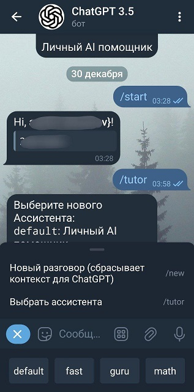

# ChatGPT Telegram Bot

This project is a Telegram bot that uses OpenAI's Assistant API to bring ChatGPT to Telegram. It uses the AsyncOpenAI client and aiogram lib  

<div align="center">
  
</div>

## Dependencies

To use this bot, you will need to set up a few things:

- **OpenAI API Key**: Create an API key at [OpenAI Platform](https://platform.openai.com/api-keys).
- **Assistant**: Create a new assistant at [OpenAI Assistants](https://platform.openai.com/assistants). You will need to note the assistant ID to configure in either `tutors.yaml` or `assistants_factory.py`.
- **Telegram Bot**: Create a new bot on Telegram via [BotFather](https://t.me/BotFather) and keep the bot token.

## Installation

1. **Clone the repository:**

```bash
git clone https://github.com/andykras/gptbot.git
```

2. **Install required packages:**

```bash
pip install -r requirements.txt
```

3. **Set environment variables:**

```bash
export LOG_LEVEL=INFO
export ORG_ID="org-..."
export API_KEY="sk-..."
export BOT_TOKEN="..."
```

4. **Prepare YAML files:**
   - `allowed_users.yaml`: Optional, add this file to restrict access to your ChatGPT bot.
   - `threads.yaml`: Will be created by the bot.
   - `tutors.yaml`: Will be created by the bot; ensure a valid default is set in `assistants_factory.py`.

## Running the Bot

To start the bot, run:

```bash
python main.py
```

Interact with your ChatGPT bot via Telegram

## Notes

- Ensure all prerequisites are met and environment variables are set before starting the bot.
- Modify `allowed_users.yaml`, `threads.yaml`, and `tutors.yaml` as needed to customize the bot's behavior.


```bash
$ LC_ALL=ru_RU python main.py | lolcat
INFO:aiogram.dispatcher:Start polling
INFO:aiogram.dispatcher:Run polling for bot @*****bot id=******* - 'ChatGPT 3.5'
INFO:httpx:HTTP Request: GET https://api.openai.com/v1/assistants/asst_******** "HTTP/1.1 200 OK"
INFO:users:retrieve assistant: *******, asst_********
INFO:actions:new_assistant:*******:default:asst_********
INFO:aiogram.event:Update id=96266759 is handled. Duration 5218 ms by bot id=*******
INFO:actions:user:*******:*******
        привет!
INFO:httpx:HTTP Request: GET https://api.openai.com/v1/threads/thread_27HpnQYhVZ9K9T5eMWsXe8y0 "HTTP/1.1 200 OK"
INFO:users:retrieve thread: *******, thread_27HpnQYhVZ9K9T5eMWsXe8y0
INFO:httpx:HTTP Request: POST https://api.openai.com/v1/threads/thread_27HpnQYhVZ9K9T5eMWsXe8y0/messages "HTTP/1.1 200 OK"
INFO:httpx:HTTP Request: POST https://api.openai.com/v1/threads/thread_27HpnQYhVZ9K9T5eMWsXe8y0/runs "HTTP/1.1 200 OK"
INFO:actions:status:queued
INFO:httpx:HTTP Request: GET https://api.openai.com/v1/threads/thread_27HpnQYhVZ9K9T5eMWsXe8y0/runs/run_3pZQzNZZtDWGFrcQsEiTG9G3 "HTTP/1.1 200 OK"
INFO:actions:status:completed
INFO:httpx:HTTP Request: GET https://api.openai.com/v1/threads/thread_27HpnQYhVZ9K9T5eMWsXe8y0/runs/run_3pZQzNZZtDWGFrcQsEiTG9G3/steps "HTTP/1.1 200 OK"
INFO:httpx:HTTP Request: GET https://api.openai.com/v1/threads/thread_27HpnQYhVZ9K9T5eMWsXe8y0/messages/msg_HSDxxZ1DPW5JSnoeAo21msOU "HTTP/1.1 200 OK"
INFO:actions:assistant:asst_********:
        Привет, ******! Чем могу помочь?
INFO:actions:done
INFO:aiogram.event:Update id=96266760 is handled. Duration 3059 ms by bot id=*******
```


## Tests

To run tests:

```bash
pip install pytest pytest-asyncio freezegun
pytest -vv test.py
```

| Test Case                                  | Status  | Progress |
|--------------------------------------------|---------|----------|
| test_retrieve_existing_thread              | PASSED  |  9%      |
| test_clear_context                         | PASSED  | 18%      |
| test_cache_thread_expiration               | PASSED  | 27%      |
| test_create_thread_for_new_user            | PASSED  | 36%      |
| test_get_list_of_assistants                | PASSED  | 45%      |
| test_get_current_assistant                 | PASSED  | 54%      |
| test_change_assistant                      | PASSED  | 63%      |
| test_defaults                              | PASSED  | 72%      |
| test_check_allowed_users[123-True]         | PASSED  | 81%      |
| test_check_allowed_users[456-True]         | PASSED  | 90%      |
| test_check_allowed_users[789-False]        | PASSED  | 100%     |

Total tests: 11, Passed: 11, Duration: 1.73s

## Deploy

Bot has been successfully deployed on the Digital Ocean platform:

```bash
$ sudo systemctl status gptbot.service
🟢 gptbot.service - ChatGPT Telegram Bot
     Loaded: loaded (/etc/systemd/system/gptbot.service; enabled; vendor preset: enabled)
     Active: active (running) since Sat 2024-01-06 07:06:54 UTC; 16h ago
    Process: 179583 ExecStart=/usr/bin/tmux new-session -d -s gptbot LC_ALL=ru_RU.UTF-8 python main.py (code=exited, status=0/SUCCESS)
   Main PID: 179585 (tmux: server)
      Tasks: 4 (limit: 498)
     Memory: 96.5M
        CPU: 16.939s
     CGroup: /system.slice/gptbot.service
             ├─179585 /usr/bin/tmux new-session -d -s gptbot "LC_ALL=ru_RU.UTF-8 python main.py"
             ├─179586 sh -c "LC_ALL=ru_RU.UTF-8 python main.py"
             └─179588 python main.py

Jan 06 07:06:54 vpn systemd[1]: Starting ChatGPT Telegram Bot...
Jan 06 07:06:54 vpn systemd[1]: Started ChatGPT Telegram Bot.

$ tmux ls
gptbot: 1 windows (created Sat Jan  6 07:06:54 2024)
```
